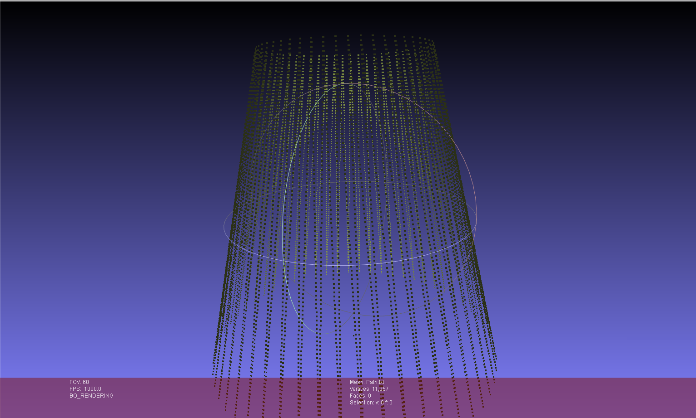
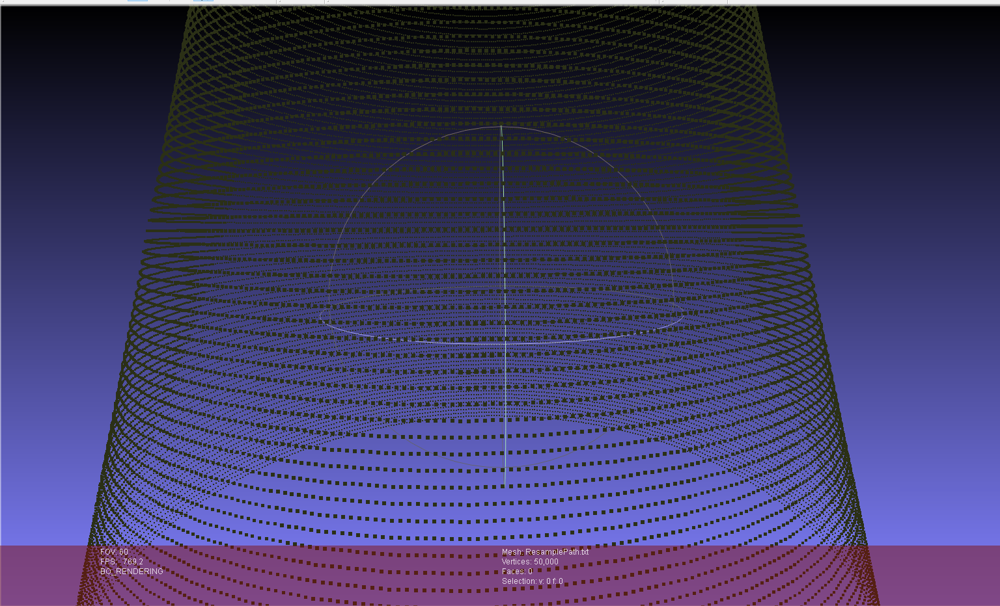

# UniformResampling

**Description:**

This is a Resample Progarm for Specific text files.

The input file(.txt) is extract from a slice Project.
    
**input:**
		X coordinate      Y coordinate
    
**ouput:**
		X coordinate      Y coordinate      Z coordinate(layer height)
    

**Test Point Set extract from STL**

**Result Point Set in meshlab**

